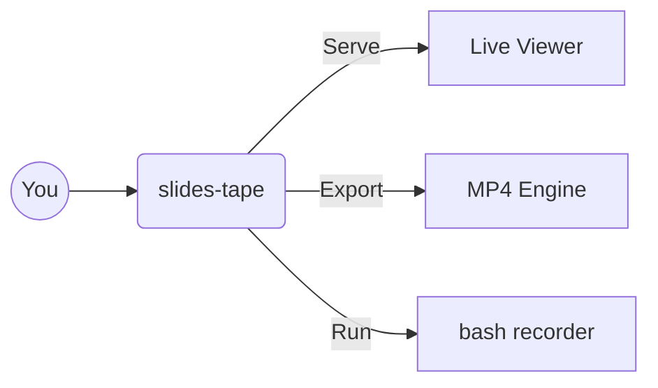

# `slides-tape`
## The Ultimate Terminal-First Presentation CLI

> Note: Welcome! This tool converts standard markdown files into polished presentations and high-quality MP4 videos.

---

## What makes it different?

Most presentation tools are built for designers. **slides-tape** is built for developers.

- **Developer Context:** Fully driven by Markdown.
- **Syntax Highlighting:** Beautiful code out of the box.
- **Diagrams:** Native Mermaid.js integration.
- **VHS-Style Recording:** Turn bash scripts into animated terminal videos.

---

## Architecture Visualisation

Support for Mermaid gives you a fast and powerful way to express architectures.



---

## Live Terminal Execution

The real magic is the `run` directive. You can declare bash blocks that actually execute.

Press **Enter** (or use the green Play button) to spin up a PTY and execute this live inside the browser, or let the `export` command capture it into your final MP4 video.

```bash run
echo "Live system information:"
echo "------------------------"
node --version
npm --version
echo "------------------------"

# @wait 1s
echo "Execution finished!"
# @wait 1.5s
```

---

## Presenter & Audience Mode

`slides-tape` ships with a native WebSocket server.

Click the **👥 Audience** button in your controls. It will spawn a clean, UI-free window that perfectly synchronizes with your presenter window as you change slides. 

Perfect for throwing onto a projector or secondary monitor.

---

## Light & Dark Themes

We also handle high-contrast environments effortlessly.

Tap the **🌓 Theme** toggle on your control bar to flip the entire UI (including the embedded terminals!) between Dark and Light mode.

---

# Thank You

**Installation:**
```bash
npm install -g slides-tape
```

**Usage:**
```bash
slides-tape serve pitch.md
slides-tape export pitch.md
slides-tape run demo.sh
```
