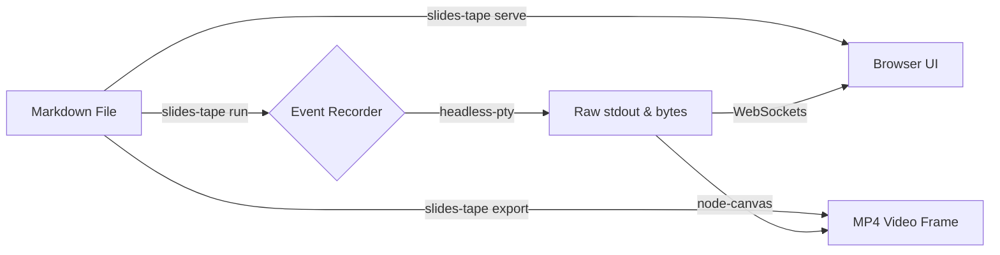

# 🚀 Slides Tape

The ultimate toolkit for highly-technical markdown presentations.

---

## What is it?

Slides Tape is built for developers, dev advocates, library maintainers, and engineers holding interactive technical presentations or recording technical demos and documentation. 

It provides:
- Live **Markdown-to-Slide** generation
- Interactive Native Terminals inside your browser
- **VHS-style** synthetic terminal directives
- FFmpeg-driven **headless MP4 video rendering**

---

## 📊 Beautiful Native Mermaid Support

Explain complex architectures effortlessly simply by writing natively supported `mermaid` blocks!



---

## 💻 Seamless Native Code Terminals

Any `bash`, `sh`, or `zsh` code block is fully connected to the backend execution runner. 

Hit **Play** on the widget below and watch the high-fidelity animation system simulate syntax-highlighted typing delays naturally over WebSockets securely!

---

## Example 1: Simple Bash Script

```bash run
# @echo off

# Ensure a nice directory exists
mkdir -p /tmp/backend-demo
cd /tmp/backend-demo
rm -f data.txt

# @echo on
# @ps1 "\033[1;36m➜\033[0m "
# @type "# The engine supports synthetic animated typing strokes"
# @type "# And even respects complex commands natively in the PTY sandbox!"
# @wait 1s
# @type "echo 'Hello from slides-tape native bash! 👋' > data.txt"
echo 'Hello from slides-tape native bash! 👋' > data.txt
# @wait 1s
# @type "cat data.txt"
cat data.txt
# @wait 2s
# @print "\033[32m✔ Terminal execution fully completed directly into your browser.\033[0m"
```

---

## Other Supported Languages

The runner natively processes non-bash languages linearly at 100% full-speed utilizing legacy cross-platform wrappers exactly as you'd conventionally expect!

```python run
# A simple python block
import sys

def main():
    print(f"Running on Python {sys.version.split(' ')[0]}")
    print("Zero animation delays, flawless execution!")

if __name__ == "__main__":
    main()
```

---

---

## 🎭 Advanced Annotations & Automation

`slides-tape`'s `bash` runner supports complex, natively intercepted syntax that bypasses the PTY while structurally interacting with the timeline.

---

## Example 2: Advanced Bash Script

```bash run
# @echo off
# @hide
# Simulating a server deployment process
echo '{ "status": "booting" }' > runtime.json
# @show
# @ps1 "\033[35mserver>\033[0m "
# @type "sudo systemctl start docker"
# @wait 1s
# @print "\033[33m[WARN] Docker engine warm-up sequence initialized.\033[0m"
# @type "Waiting for port 3000..."
# @await port 3000
# @wait 800ms
# @clear
# @ps1 "\033[32m✔\033[0m "
# @type "Docker payload successfully deployed."
# @type "exit"
```

> Explore `# @await http <url>`, `# @await file <path>`, and `# @clear` to script highly specific integration tests inside your videos!

---

## 📝 Presenter Mode & Speaker Notes

Are you presenting `slides-tape` live to an audience? Open up the **👥 Audience** panel in the corner and place it on your secondary presentation screen!

> Use `> Note: Use this to explicitly drop cues, runtime context, and internal markers directly into your decks without compromising the audience's view! If you are the presenter, you can see this text explicitly within the Audience controls view, but it is deeply stripped and completely physically invisible on the main presentation projector output!`

> Note: Use this to explicitly drop cues, runtime context, and internal markers directly into your decks without compromising the audience's view! If you are the presenter, you can see this text explicitly within the Audience controls view, but it is deeply stripped and completely physically invisible on the main presentation projector output!
---

## 🌐 Full-Stack Browser UI Automation

`slides-tape` isn't just limited to terminals! It has an entire `Puppeteer` automation engine fused internally into its `.tre` event loops!. 
Creating a web script is extremely straightforward! It acts essentially like a simplified markup language that orchestrates the hidden browser sequence.

Drop a `web run` block to instantly open an invisible Headless Chrome engine. `slides-tape` drives the clicks, fetches the external website, and natively pipes massive 60FPS JPEG streams across the WebSockets back to your presenter screen—completely sidestepping frustrating Cross-Origin iframe security locks!

```web run
# @goto https://news.ycombinator.com/
# @wait 800ms
# @click .titleline > a
# @wait 1500ms
```

>Hit **Play** to instantly spin up the Puppeteer stream and hijack the active terminal display canvas locally!
Within those blocks, slides-tape natively interprets the following syntax directives line-by-line (you can prefix them with either #  or // )

---
## The Core Commands

```
# @goto <url>: Navigates the internal browser to a specific destination.
Example: # @goto https://example.com or # @goto http://localhost:8080/dashboard
# @wait <time>: Pauses the execution intentionally (essential for letting CSS animations or networking finish).
Example: # @wait 1s or # @wait 500ms
# @click <CSS selector>: Triggers a physical mouse-click on any element within the DOM.
Example: # @click .login-button or # @click input[type="submit"]
# @type <CSS selector> <text>: Simulates a real human organically typing data sequentially into an element. 
You can optionally wrap the text in quotes (" ") if it contains spaces.
Example: # @type #username john_doe or # @type #password "my secret phrase"
```
---
<!--duration: 10s -->

## Advanced Native Javascript
If you need to execute complex logical interactions that the basic layout commands don't cover, simply write raw Javascript.

Any block lines that don't start with # @ or //  are securely sandboxed and evaluated directly inside the target webpage's DOM organically via page.evaluate()!

```web run
# @goto https://example.com
# @wait 1s

# This is standard Javascript, not a directive
const title = document.querySelector('h1').innerText;
console.log('The title is:', title);

# @wait 1s
```
---
<!--duration: 10s -->

# 🌐 Testing Web UI Recording

## Complete Example

```web run
# 1. Boot up the local dev server
# @goto http://localhost:4200/login
# @wait 800ms

# 2. Emulate the user dropping their credentials
# @type input[name="email"] "admin@studio.co.ke"
# @type input[name="password"] "password"
# @wait 400ms

# 3. Simulate the button press
# @click form > p-button > button[type="submit"]

# 4. Wait for the networking latency to finish rendering the dashboard
# @wait 2s

# 5. Go to the settings page
# @goto http://localhost:4200/settings
# @wait 2s

# 6. Go to the Services Tab
# @click p-tab[id="pn_id_4_tab_services"]
# @wait 3s

# 7.Select an item to edit
# @click table > tbody > tr:nth-child(1) > td:last-child > button[title="Edit"]
```
---

## ⚡ The Power of `.tre` Event Logs

Generating flawless high-resolution terminal videos for tasks that require long networking times natively (like docker builds or `npm install`) is historically painful.

With `slides-tape`, every execution natively caches its temporal footprints and chunked raw stdout into a `.tre` artifact beside your rendering automatically!

You can completely **short-circuit execution** and immediately re-render visual outputs using loaded logs. Instantly re-spit MP4s dynamically editing your `--font-size`, `--resolution`, and multiplying the typing `--speed` completely detached from evaluating bash again!

---

## Example 3: Terminal Replay Event Log

```bash run
# @echo off
# @hide
echo '{"e":"typing","cmd":"npm install @xterm/headless","t":0}' > demo.tre
echo '{"e":"cmd_start","cmd":"mocked","t":10}' >> demo.tre
echo '{"e":"output","data":"added 118 packages in 48s","t":50}' >> demo.tre
# @show
# @echo on

# @type "# Re-render massive sequences instantaneously!"
# @type "slides-tape run build.sh --load-events raw.tre --speed 4.0 --font-size 22"
```

---

## 🖨️ Exporting & Publishing

Everything evaluates completely headless. `slides-tape` functions flawlessly within CI/CD pipelines!

```bash run
# @echo off
# @ps1 "\033[1;36m$\033[0m "

# @type "# Generate a stunning multi-page static PDF rendering of all slides:"
# @type "slides-tape export deck.md -o output.pdf --width 1920 --height 1080"

# @wait 800ms
# @print ""

# @type "# Synthesize a lossless `.mp4` 60fps video directly from a bash file:"
# @type "slides-tape run compile.sh -H 1440 -W 2560 -f 60 --format mp4"
```

---

# 🚀 Installation & Usage

You can deploy `slides-tape` directly from NPM for global availability, or run it entirely locally by cloning the repository!

```bash run
# @echo off
# @hide
# Mocking output for visuals
echo '{ "version": "1.0.0" }' > package.json
# @show
# @ps1 "\033[36m~\033[0m "

# @type "# Option 1: Global NPM Installation"
# @type "npm install -g slides-tape"
# @wait 800ms
# @clear 

# @type "# Option 2: Local GitHub Clone"
# @type "git clone https://github.com/my-repo/slides-tape.git"
# @type "cd slides-tape && npm install"
# @wait 1s
# @type "npm link"
# @print "\033[32m✔ Success: globally linked 'slides-tape' to local directory.\033[0m"
```

---

## 🛠️ The Global CLI Commands

### 1. The Presentation Server (`serve`)
```bash
slides-tape serve presentation.md --port 3000
# Pass `--no-open` if you want to prevent your default browser from capturing focus automatically!
```

### 2. The Video Exporter (`export`)
```bash
slides-tape export presentation.md --resolution 1280x720 --fps 60
```

### 3. The Bash Script Video Renderer (`run`)
```bash
slides-tape run script.sh --speed 2 --format webm
```
### 4. The Web Script Video Renderer (`web`)
```bash
slides-tape web script.web --format webm
```